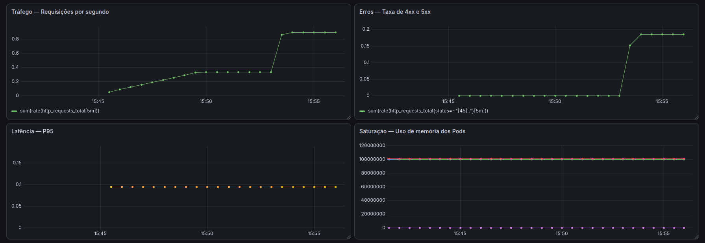
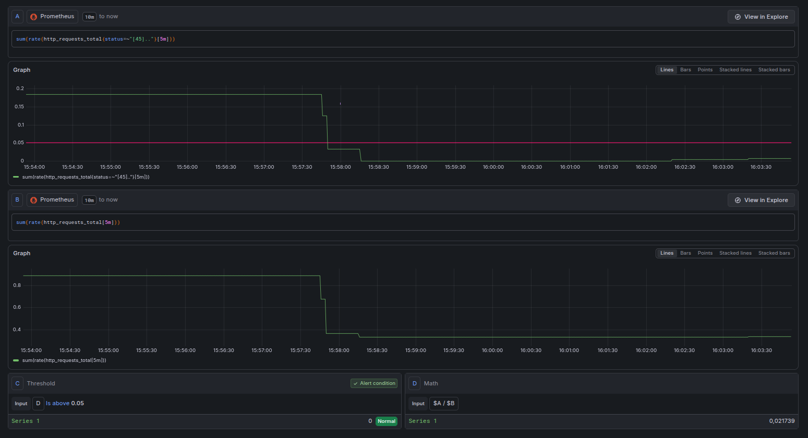

# Move Tech — Cloud Application

Projeto desenvolvido durante a formação **Move Tech — Cloud Computing**, da Magalu Cloud em parceria com a Prósper Digital Skills.

A aplicação consiste em uma API de pedidos para um micro e-commerce, desenvolvida com **Python e FastAPI** e implantada na **Magalu Cloud**.

O projeto percorre o ciclo completo de uma aplicação em nuvem: containerização, persistência de dados, orquestração, CI/CD, observabilidade e documentação de arquitetura.

## Arquitetura

A aplicação é executada em containers Docker dentro de um cluster **K3s**, com duas réplicas da API. Os dados são persistidos em um **PostgreSQL gerenciado (DBaaS)** e as imagens da aplicação são armazenadas no **Container Registry da Magalu Cloud**.

O processo de entrega é automatizado pelo **GitHub Actions**, que executa os testes, constrói a imagem Docker, publica a imagem no registry e realiza o deploy no Kubernetes.

A documentação completa da arquitetura está disponível em [`docs/architecture.md`](docs/architecture.md).

## Tecnologias

- Python
- FastAPI
- Docker
- Kubernetes / K3s
- PostgreSQL / SQLAlchemy
- Magalu Cloud
- GitHub Actions
- Prometheus
- Grafana
- PromQL

## Funcionalidades da API

| Método | Rota | Descrição |
|---|---|---|
| `GET` | `/health` | Verifica a saúde da aplicação |
| `POST` | `/orders` | Cria um novo pedido |
| `GET` | `/orders` | Lista os pedidos |
| `GET` | `/orders/{id}` | Retorna um pedido |
| `DELETE` | `/orders/{id}` | Cancela um pedido |
| `POST` | `/orders/{id}/items` | Adiciona um item ao pedido |
| `GET` | `/orders/{id}/items` | Lista os itens de um pedido |
| `GET` | `/metrics` | Expõe métricas para o Prometheus |

## Observabilidade

A aplicação utiliza **Prometheus e Grafana** para coleta e visualização de métricas.

Foi criado um dashboard baseado nos **Golden Signals**, permitindo acompanhar:

- **Tráfego:** taxa de requisições por segundo
- **Erros:** taxa de respostas HTTP 4xx e 5xx
- **Latência:** percentil 95 (P95) do tempo de resposta
- **Saturação:** consumo de memória dos pods

### Dashboard — Golden Signals

Também foi configurada uma regra de alerta no Grafana para identificar quando a proporção de erros HTTP ultrapassa **5% por um período de 5 minutos**.

### Alerta — Taxa de erros

## CI/CD e Deploy

O processo de entrega da aplicação é automatizado com **GitHub Actions**.

O pipeline executa as seguintes etapas:

1. Executa os testes automatizados com `pytest`
2. Constrói a imagem Docker da aplicação
3. Publica a imagem no **Container Registry da Magalu Cloud**
4. Configura o acesso ao cluster Kubernetes
5. Cria o Secret com a conexão do banco de dados
6. Realiza o deploy da aplicação no **K3s**

A aplicação é executada com **duas réplicas**, utilizando o Klipper ServiceLB para distribuir o tráfego e disponibilizar a API externamente.

### Fluxo de entrega

`Código → GitHub Actions → Docker Build → Container Registry → K3s → Aplicação`

## Persistência de Dados

A aplicação utiliza **PostgreSQL gerenciado (DBaaS) na Magalu Cloud** para persistência dos dados.

O acesso ao banco é realizado pela aplicação utilizando **SQLAlchemy**, com a string de conexão fornecida ao cluster por meio de um Kubernetes Secret.

O modelo possui duas entidades principais:

- **Orders:** representa os pedidos realizados
- **Items:** representa os itens associados a cada pedido

A relação entre pedidos e itens é **1:N** — um pedido pode possuir vários itens.

A modelagem completa está documentada em [`docs/data-model.md`](docs/data-model.md).

## Documentação

O repositório também contém a documentação das principais decisões e componentes da solução:

- [`docs/architecture.md`](docs/architecture.md) — arquitetura, diagrama, requisitos não-funcionais, trade-offs e pontos de melhoria
- [`docs/data-model.md`](docs/data-model.md) — modelagem e relacionamento dos dados
- [`docs/adr/001-kubernetes-deploy.md`](docs/adr/001-kubernetes-deploy.md) — decisão pelo uso de K3s
- [`docs/adr/002-dbaas-postgresql.md`](docs/adr/002-dbaas-postgresql.md) — decisão pelo uso de PostgreSQL gerenciado

---

Projeto desenvolvido durante a formação **Move Tech — Cloud Computing**, da Magalu Cloud.

Aplicação baseada no tutorial **Construindo APIs robustas utilizando Python**, do LuizaLabs.

---
## Sobre mim

Sou Engenheira Química e estudante de Análise e Desenvolvimento de Sistemas, com foco em Análise de Dados.

Gosto de criar soluções que organizam informações, automatizam processos e ajudam na tomada de decisão. Neste projeto, explorei também o universo de Cloud Computing, aplicando conceitos de containers, CI/CD, Kubernetes, banco de dados e observabilidade.

Conheça meus outros projetos no [GitHub](https://github.com/mgabrielamnts).